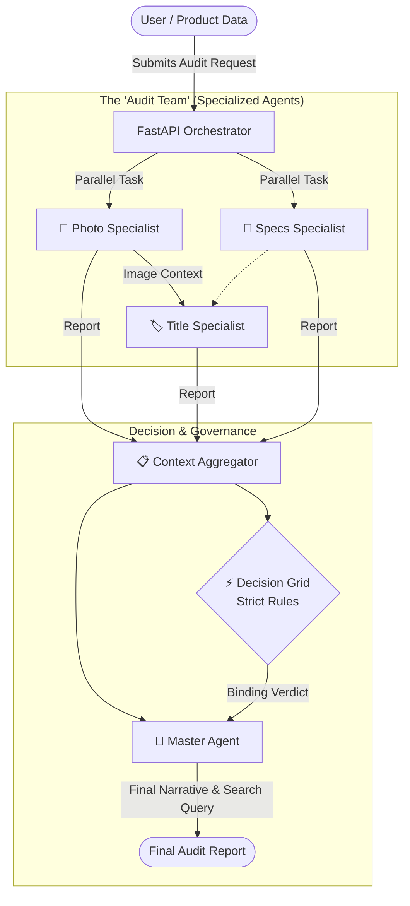
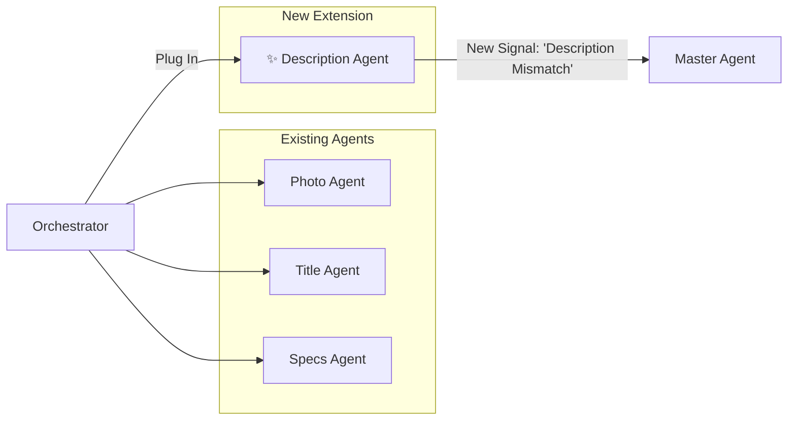
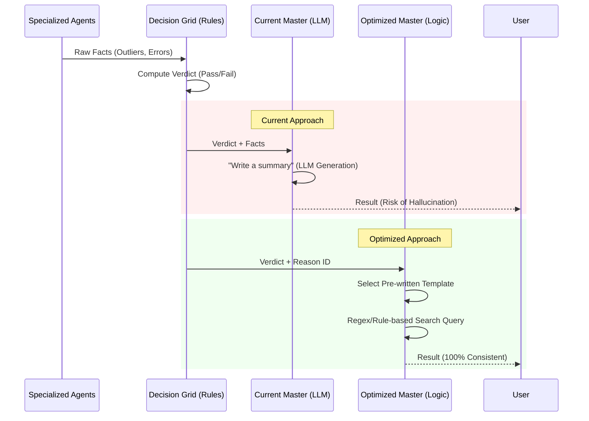

# Multi-Agent System: High-Level Overview & Strategic Optimization

## 1. Executive Summary

This document outlines the architectural workflow of the Multi-Agent Auditor system. It is designed to be **modular**, **scalable**, and **cost-efficient**. By breaking down the complex task of "auditing" into smaller, specialized sub-tasks, we achieve higher accuracy and transparency compared to a single "black-box" AI model.

---

## 2. High-Level Workflow

The system operates like a human audit team: verified specialists examine specific aspects of a product (Photo, Title, Specs) independently, and a "Manager" (Master Agent) synthesizes their findings to make a final decision.

### System Flow Diagram

### Key Stages

1.  **Orchestration**: The system receives a product.
2.  **Specialized Analysis**:
    - **Photo Agent**: Looks at the image quality, content, and safety.
    - **Specs Agent**: Checks technical specifications for errors.
    - **Title Agent**: Validates the title, ensuring it matches the image (using the Photo Agent's findings).
3.  **Governance (The Decision Grid)**: A deterministic "Rule Book" evaluates the findings (e.g., "If Photo is blurry AND Title matches, Flag as Review"). This ensures **predictable compliance**.
4.  **Final Synthesis**: The Master Agent wraps the strict decision in a human-readable summary.

---

## 3. Modularity: Plugging in New Agents

The system is built on a **"Plug-and-Play"** architecture. Adding a new capability, such as a **Description Agent**, does not require rewriting the core logic.

### Example: Adding a Description Agent

**Steps to scale:**

1.  **Define Skill**: Create the `DescriptionAgent` focused solely on description text vs. image.
2.  **Register**: Add 2 lines of code to the `Orchestrator` to initialize it.
3.  **Update Rules**: Add a column to the `Decision Grid` (e.g., "If Description contradicts Photo -> Fail").

---

## 4. LLM Overhead & Cost Analysis

Breaking the task into agents allows us to use **Right-Sized Models**, optimizing the cost-to-performance ratio.

| Component        | Task Complexity             | Recommended Model           | Cost Implication         |
| :--------------- | :-------------------------- | :-------------------------- | :----------------------- |
| **Photo Agent**  | High (Visual Understanding) | **Gemini 1.5 Flash/Pro**    | Moderate (Visual tokens) |
| **Specs Agent**  | Low (Text extraction)       | **Gemini Flash / Gemma 7B** | 📉 Very Low              |
| **Title Agent**  | Medium (Cross-reference)    | **Gemini Flash**            | 📉 Low                   |
| **Master Agent** | Medium (Synthesis)          | **Gemini Flash** (Current)  | Low                      |

**Total Audit Cost vs. Single Large Model:**

- **Single Giant Model (e.g., GPT-4o / Gemini Ultra)**: High cost per audit, slower, harder to debug.
- **Multi-Agent (Flash + Specialized)**: ~40-60% cheaper. You only pay for "Vision" capabilities when analyzing the photo, not when checking the title's spelling.

---

## 5. Strategic Optimization: The "Dumb" Master Agent

### Current State

The `MasterAgent` uses an LLM (Gemini Flash) to generate the final summary and the "Product Search Query".

- **Risk**: LLMs can "hallucinate" (invent facts) when summarizing, potentially contradicting the strict `Decision Grid`.

### Proposed Strategy: "Function-Based" or "Dumb" Master

We can replace the "thinking" Master Agent with a deterministic logic block or a tiny, specialized model (e.g., Gemma 2B/Function Calling).

### Analysis & Recommendation

#### Option A: Switch to Gemma 300M / 2B (Small Model)

- **Pros**: Extremely cheap, runs fast.
- **Cons**: Might struggle with semantic nuances if the summary needs to be creative. 300M is likely _too_ small for coherent English summarization, but 2B-7B is a sweet spot.

#### Option B: Function Calling / Structured Output (Current Best Practice)

- Instead of asking the LLM to "chat", we force it to output strictly structured JSON.
- **Impact**: drastically reduces hallucination because the model is constrained to specific schemas.

#### Option C: The "No-LLM" Master (Pure Logic)

- **Idea**: Since the `Decision Grid` already decides "Pass/Fail", we use templates for the reason.
  - _Decision_: "FAIL"
  - _Reason Code_: "PHOTO_BLURRY"
  - _Template_: "The audit failed because the primary product image is too blurry."
- **Search Query**: Instead of asking an LLM to "invent" a search query, we simply concatenate `Title Brand` + `Title Product Name`.
- **Verdict**: **Recommended for high-stakes compliance.** It removes the "Wild Card" of the LLM from the final decision step.

### Final Recommendation for PM

> **Retain the specialized agents (Photo/Title) as AI models** because they need "human-like perception."
>
> **Transition the Master Agent to a deterministic Logic Controller.**
>
> 1.  Trust the `Decision Grid` 100%.
> 2.  Use standard templates for explanations.
> 3.  Use rule-based string construction for Search Queries.
>
> **Benefit**: Zero hallucinations in the final verdict, lower costs, and faster response times.
