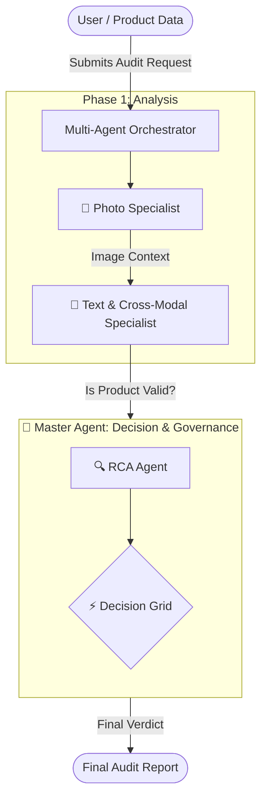

# Multi-Agent System: High-Level Overview & Strategic Optimization

## 1. Executive Summary

This document outlines the architectural workflow of the Multi-Agent Auditor system. It is designed to be **modular**, **scalable**, and **cost-efficient**. By breaking down the complex task of "auditing" into smaller, specialized sub-tasks, we achieve higher accuracy and transparency compared to a single "black-box" AI model.

---

## 2. High-Level Workflow

The system operates like a human audit team: verified specialists examine specific aspects of a product (Photo, Text) sequentially, and a "Manager" (Master Agent) synthesizes their findings to make a final decision.

### System Flow Diagram

### Key Stages

1.  **Visual Analysis (PhotoAgent)**: Looks at the image quality, content, and extracts text (OCR).
2.  **Textual & Cross-Modal Analysis (TextualAgent)**: Validates Title and Specs. Crucially, it checks for consistency between the text and the visual evidence provided by the Photo Agent.
3.  **Decision & Governance (MasterAgent)**: The final decision-maker. It incorporates the **Root Cause Analysis (RCA Agent)** to synthesize findings and the **Decision Grid** (deterministic rules) to issue a binding PASS/FAIL/REVIEW verdict.

---

## 3. Modularity & Scalability

The system is built on a **"Plug-and-Play"** architecture. New agents can be inserted into the orchestration logic with minimal friction.

### Benefits of this Architecture

1.  **Specialization**: Each agent uses a prompt optimized for its specific task (e.g., Vision for photos, Text analysis for specs).
2.  **Context Awareness**: Downstream agents (like `TextualAgent`) benefit from the "eyes" of upstream agents (`PhotoAgent`).
3.  **Cost Efficiency**: We can skip expensive steps if the product is already flagged as a "Critical Fail" in earlier stages.

---

## 4. LLM Overhead & Cost Analysis

Breaking the task into agents allows us to use **Right-Sized Models**, optimizing the cost-to-performance ratio.

| Component          | Task Complexity             | Recommended Model           | Cost Implication         |
| :----------------- | :-------------------------- | :-------------------------- | :----------------------- |
| **Photo Agent**    | High (Visual Understanding) | **Gemini 1.5 Flash**        | Moderate (Visual tokens) |
| **Textual Agent**  | High (Cross-Modal Logic)    | **Gemini 1.5 Flash**        | Low                      |
| **RCA Agent**      | Medium (Synthesis)          | **Gemini 1.5 Flash**        | Low                      |
| **Master Agent**   | Low (Lookup + Formatting)   | **Gemini 1.5 Flash**        | Low                      |

**Total Audit Cost vs. Single Large Model:**
- **Single Giant Model (e.g., GPT-4o / Gemini Pro)**: High cost per audit, slower.
- **Multi-Agent (Flash)**: Significantly cheaper.

---

## 5. Strategic Optimization: The Decision Grid

### The "Dumb" Master Agent

The `MasterAgent` is designed to be deterministic regarding the *decision* (Pass/Fail) while using the LLM only for the *recommendation*.

1.  **Reliability**: The decision logic is hard-coded in a Truth Table (`decision_grid.csv`). An LLM hallucination cannot accidentally "Pass" a bad product.
2.  **Consistency**: Identical error patterns always yield the exact same verdict code.
3.  **Politeness**: The LLM is used strictly to phrase the rejection/review message politely, not to decide *if* it should be rejected.
