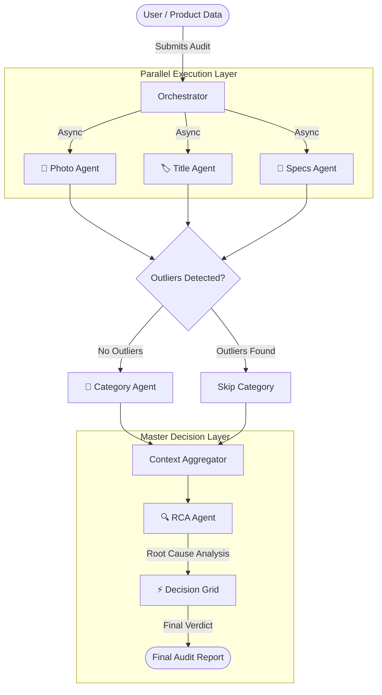

# Implementation Plan: Parallel Multi-Agent Audit v2

## 1. Goal
Optimize the audit workflow for speed (parallelization) and intelligence (Root Cause Analysis), while making the final decision deterministic.

## 2. Updated Architecture

## 3. Detailed Changes

### A. Parallelization & Dependency Removal
- **MultiAgentOrchestrator**: Modify `run_audit` to trigger `PhotoAgent`, `TitleAgent`, and `SpecsAgent` using `asyncio.gather`.
- **TitleAgent**: Remove requirement for `photo_analysis` in its prompt logic to allow independent execution.

### B. Conditional Category Agent
- **CategoryAgent**: Create new agent specialized in product categorization.
- **Orchestrator Logic**:
    - Analyze status/outlier flags from the first 3 agents.
    - If all agents report `success` (no major outliers), trigger `CategoryAgent`.
    - Otherwise, skip to save cost and time.

### C. Refactored Master Layer
- **RCA Agent**: A new specialized agent that synthesizes findings from all previous agents into a structured Root Cause Analysis report.
- **Decision Grid**: A deterministic logic engine (the "Dumb Agent") that takes the RCA output and matches it against pre-defined compliance rules to issue the final Pass/Fail verdict.
- **MasterAgent**: Refactored to act as the coordinator for RCA and Decision Grid.

## 4. Implementation Steps
1. **Schemas**: Update `app/schemas/agent_schemas.py` to include `CategoryResponse` and `RCAResponse`.
2. **Agents**: 
    - Implement `app/services/agents/category_agent.py`.
    - Implement `app/services/agents/rca_agent.py`.
3. **Orchestrator**: Update `app/services/multi_agent_orchestrator.py` logic.
4. **Master Refactor**: Update `app/services/agents/master_agent.py`.
5. **Rules**: Ensure `app/core/decision_grid.py` is updated for the new structured input.
